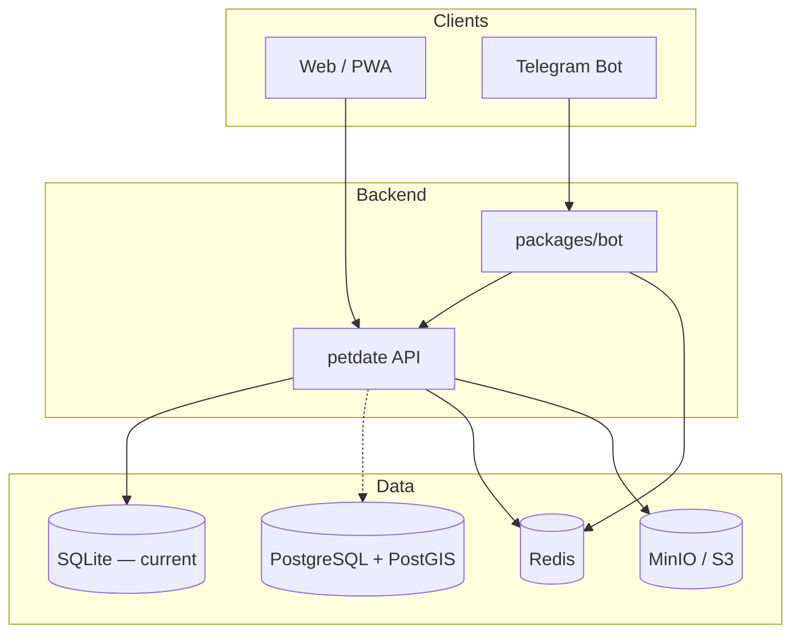

# Petdate Backend Architecture

Petdate is a pet playmate matching platform with **two equal client channels**: the **Web/PWA** and the **Telegram bot**. Both talk to the same API and share users via `telegram_id`.

## Stack Overview

| Service | Technology | Role |
|---------|------------|------|
| Web client | React + Vite PWA | Primary UI — profiles, explore, admin |
| Telegram bot | grammY (`packages/bot`) | Onboarding, quick actions, deep links to web |
| API | Express (`packages/api`) | Business logic, auth bridge, media URLs |
| Main database | SQLite (`packages/api/data/petdate.db`) | Users, pets, chats, wallet — **single source of truth for web + bot** |
| Cache / sessions | Redis (bot UI sessions) / file fallback | Bot wizard state only — not profile/pet data |
| Object storage | MinIO / S3 *(optional)* | Pet images and media |
| Advanced search | Elasticsearch *(optional)* | Full-text search |

> **Important:** The Telegram bot does **not** keep a separate user/pet database. Profile data always goes through the API SQLite. See `docs/UNIFY_BOT_WEB_DB.md`.

The API currently runs on **SQLite**. `DATABASE_URL` (PostgreSQL) is reserved for a future adapter and must not be treated as the live store until that ships.

## Client Channels



### Web / PWA

- Full onboarding wizards per role (pet owner, vet, pet seeker, …)
- Explore, matches, admin panel
- URL: `WEB_URL` (default `http://localhost:5173`)

### Telegram Bot

Package: `packages/bot` (grammY + ioredis)

| Flow | Behavior |
|------|----------|
| `/start` | Upsert user via `POST /api/users/register` with `telegram_id` |
| Role pick | Inline keyboard → `PATCH /api/users/telegram/:id/role` |
| Session | Redis key `petdate:bot:session:{telegramId}` (7-day TTL) |
| Heavy UI | Deep link to web (`/profile`, `/explore`, `/add-pet`) |

**Dev:** long polling (leave `BOT_WEBHOOK_URL` empty).  
**Prod:** keep `BOT_WEBHOOK_URL` **empty** (polling) until a real webhook HTTP listener exists. Do **not** set `BOT_WEBHOOK_URL` / `BOT_WEBHOOK_SECRET` in production yet.

Commands: `/start`, `/explore`, `/help`

## Service Roles

### PostgreSQL + PostGIS

- Primary durable store (see `infra/postgres/init.sql`)
- `users.telegram_id` links bot and web accounts
- PostGIS on `pets.location` for nearby playmates

### Redis

- Bot session state (`packages/bot/src/session.ts`)
- Future: online presence, match queues, rate limits

### MinIO / S3

- Pet photos; API stores object keys in DB
- Local: port 9000 (API), 9001 (console)

### Elasticsearch *(optional `search` profile)*

- Advanced search — Phase 5

## Environment

See `.env.example`. Key groups:

- **App:** `WEB_URL`, `API_URL`
- **Bot:** `TELEGRAM_BOT_TOKEN`, `TELEGRAM_BOT_USERNAME` — leave `BOT_WEBHOOK_URL` empty in prod (polling)
- **DB:** `DATABASE_URL` (Postgres), `DATABASE_PATH` (SQLite fallback)
- **Redis:** `REDIS_URL`
- **S3:** `S3_*`

Config loader: `packages/api/src/config/infra.ts`

## Phase Plan

### Phase 1 — UI + SQLite + Bot skeleton *(current)*

- Web UI complete; bot `/start` + role selection
- Docker infra ready; SQLite still used by API
- Redis sessions for bot

### Phase 2 — PostgreSQL + role onboarding

- Migrate API to Postgres; PostGIS for nearby pets
- Web + bot share role/onboarding state

### Phase 3 — Redis realtime

- Presence, match queues, notifications

### Phase 4 — S3 production

- Upload pipeline, CDN URLs

### Phase 5 — Elasticsearch

- Advanced search

## Local Commands

```bash
npm run infra:up      # Postgres, Redis, MinIO
npm run dev:api       # API :3001
npm run dev:bot       # Telegram bot (needs TELEGRAM_BOT_TOKEN)
npm run dev           # Web :5173
```

See [infra/local-setup.md](./infra/local-setup.md).
